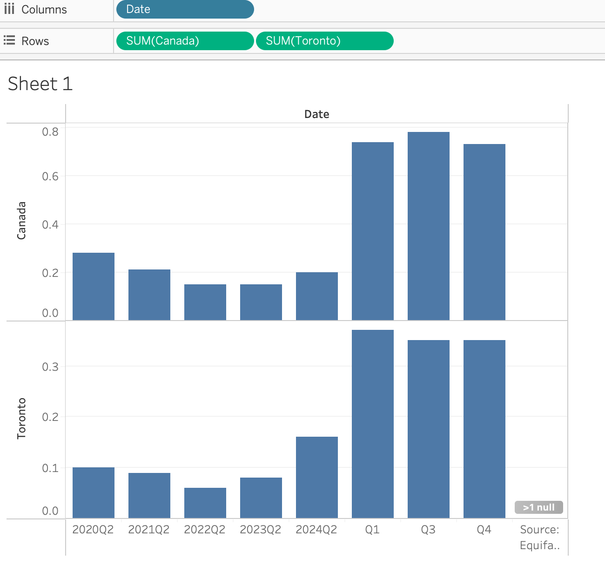
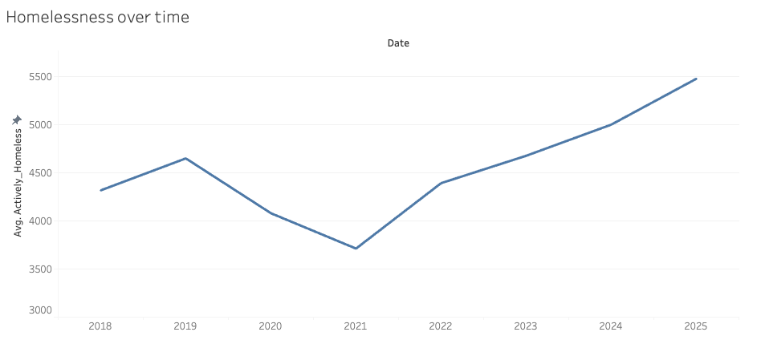
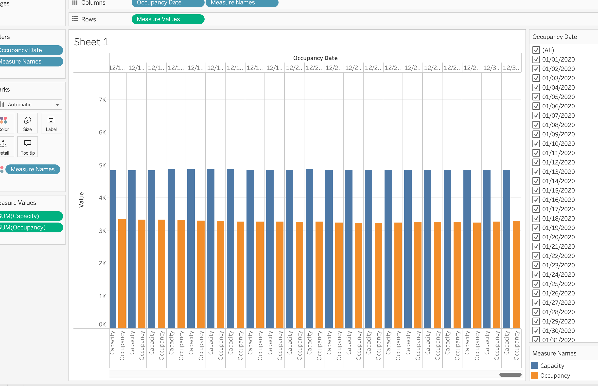
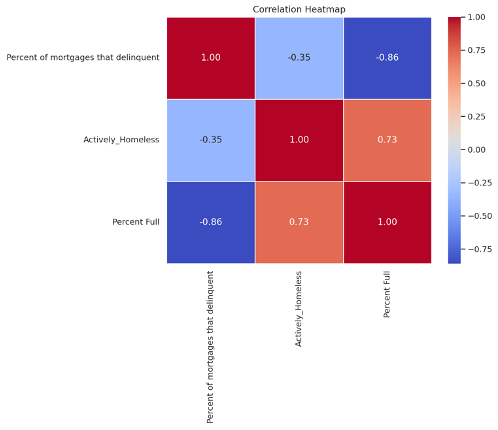
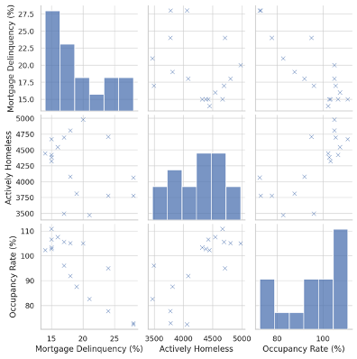

# Housing Affordability and Rising Homelessness in Ontario  

[Read Detailed Background Information Here](Background.md)
 
*By: Hailey Burk*
## Executive Summary: 

The issue of affordability of housing and homelessness within the province of Ontario has emerged as a significant challenge the region continues to face. With the substantiated rise in housing costs and a continual increase in stagnating wages, a significant portion of individuals and families continue to face complex hurdles in obtaining affordable and stable housing. The problem is highlighted even further as more and more individuals turn to shelters and encampments which is further straining the social services in the region. This project will cover major factors through an analysis of open data including trends in rental prices, homeownership expenses, homelessness figures, and government spending. Hoping to provide information that can shape policy, propose strategies in accessible housing options, and aim at decreasing homelessness by creating informed knowledge out of the research. 
 
## Key Performance Indicators (KPIs) 
1. Mortgage and Consumer Credit Trends
   - Rising mortgage delinquency and foreclosure rates contribute to higher homelessness rates.

3. Homeownership Affordability Index
   - Percentage of household income required to afford an average home in Ontario.
   - Frequency: Monthly??
4. Number of Households on Affordable Housing Waitlists
   - Total number of households waiting for subsidized housing in Ontario.
5. Homelessness Rate per 10,000 Residents
   - Number of individuals experiencing homelessness per 10,000 people.
   - Frequency: Monthly??
6. Government Funding for Affordable Housing Programs
   - Total provincial and federal funding allocated to affordable housing initiatives.
   - Frequency: Yearly?

## References

Association of Municipalities of Ontario. (2025). Ending chronic homelessness in Ontario: A municipal approach. Association of Municipalities of Ontario. https://www.amo.on.ca/sites/default/files/assets/DOCUMENTS/Reports/2025/2025-01-08-EndingChronicHomelessnessinOntario.pdf

School of Cities, University of Toronto. (2024). Canada’s housing crisis: Challenges and policy solutions. University of Toronto. https://schoolofcities.utoronto.ca/wp-content/uploads/2024/06/School-of-Cities_Housing-Crisis-Final3.pdf

## Analysis 

   
This plot looks at the Delinquency rates wihin Canada and Toronto. I am analyzing delinquency rates because they show how many people have a hard time paying their rent or mortgage. Increased defaults on payments put more people at greater risk of losing their homes, which increases the possibility of homelessness. By studying these rates, I assess the possible relationships between financial difficulties and the trends of homelessness. Higher rates of delinquency would suggest higher rates of homelessnes.The spike in 2024 suggests more people are missing payments, which could lead to higher homelessness rates.

   
This plot looks at the average homelessness over time in Canada. Starting in 2018 all the way to 2025. In this gragh we can see that homelessness dropped in 2021, this makes sense due to the COVID-19 pandemic. After the pandemic was over, we can see that homlessness increased again and is still on the inclined. From the start of the pandemic until today, we can see that the average of indidivuals left homeslessness has almost doubled. 

   
This plot looks at the occupacity and capacity wihtin shelters in Canada. COmapring these two can help us take a look at the difference. If the governemnt is trying to help issues of Homlessness or if the Shelters are at or over capcity and the governemnt needs to provide mroe resources for these individuals. In this specific graph, we are looking only at teh year 2020 ( for milestone 3, we have created extra 'made up' data to make a better corelation). This graph illustrates the relationship between shelter capacity (total available spaces) and occupancy (actual number of people using the shelters) over time. The blue bars depict the total shelter space, and the orange bars represent the total number of people in the shelters. The information suggests that even though some shelters have space for people to stay, they are not completely full to capacity. This is significant in comprehending homelessness as it prompts one to ponder why individuals might not be utilizing the shelters – is it the case of eligibility parameters, security issues, or simply not knowing.

## Key Takeaways  

1.	Occupancy Rate and Mortgage Delinquency Are Strong Predictors of Homelessness
   - The multiple regression model indicates an R-squared value of 0.821 which suggests that 82.1% of variation in homelessness is due to mortgage delinquency and occupancy rate. Mortgage delinquency has a coefficient of 109.978 which indicates that for every 1% rise in mortgage delinquency, the number of people who are actively homeless increases by close to 110. Occupancy rate has a coefficient of 60.566 which indicates that for every 1% rise in occupancy rate, the number of homeless people increases by internments of approximately 61. Both predictors have very small p-values (p less than 0.001) which confirms that these relationships do exist.
2.	Occupancy Rate Does Not Decrease Homelessness
   - Common belief would suggest that an increase in utilization of space within a housing facility (occupancy rate) would lead to a decrease in homelessness. The fact that the coefficient is positive means that higher levels of occupancy rate is associated with higher levels of homelessness. This indicates that housing facilities are likely to be at over-capacity and yet, there are still some people who do not have housing options available. Standard Exploratory Data Analysis may show straightforward traces of correlation, but this model demonstrates that higher occupancy rates might not necessarily mean lower rates of homelessness, instead it suggests the scarcity of housing.
 3.	How Mortgage Skipping Payments Can Predict Homelessness
    - It is likely that escalating mortgage delinquency will lead to higher rates of homelessness soon, so mortgage delinquency can act as a bellwether. Increasing mortgage delinquencies may suggest an upcoming spike in homelessness, which could be addressed before it occurs. Delinquency predictive modeling could give decision-makers more time to invest in housing resources ahead of time when some areas have rising delinquency tendencies

## Regression   
Regression Summary: 
- Metric	Value
- R-squared 	0.82099
- Adjusted R-squared	0.7954187
- F-Statistic 	32.10426
- P-value 	5.890030

   

   
This correlation heatmap shows the strength and directions of relationships between Mortgage Delinquency, Actively Homeless and Percent Full (Occupancy Rate). The red – blue gradient demonstrates the strength of the correlations, red indicating a strong positive correlation, and blue a strong negative correlation. here is a strong negative correlation between Mortgage Delinquency and Occupancy Rate (-0.86), meaning that higher delinquencies are associated with lower occupancy.There is a moderate positive correlation between Actively Homeless and Occupancy Rate (0.73), implying that areas with more homeless individuals tend to have lower availability of housing.
There is a mild negative correlation between Mortgage Delinquency and Actively Homeless (-0.35). There is context numerically to the visual relationships within this heatmap alongside the pair plots, which strengthens the trends observed in the pair plots.

   
In this example, three pivotal variables are laid out: percentage of Mortgage Delinquency, Actively Homeless, and Occupancy Rate- which contributes to the analysis at hand. Value distributions of a particular variable are shown along the diagonals, whereas the relationships between two variables are depicted in out of diagonal scatter plots. For instance, there is a negative correlation noted between Mortgage Delinquency and Occupancy Rate suggesting that delinquency increases, occupancy rates drop. Likewise, the Actively Homeless variable is indicated to have a positive correlation with Occupancy rate, meaning that areas with greater homelessness rates also tend to have higher rates of occupancy in housing. This aids in drawing out trends and relationships between different variables and aid in analyzing housing data.
